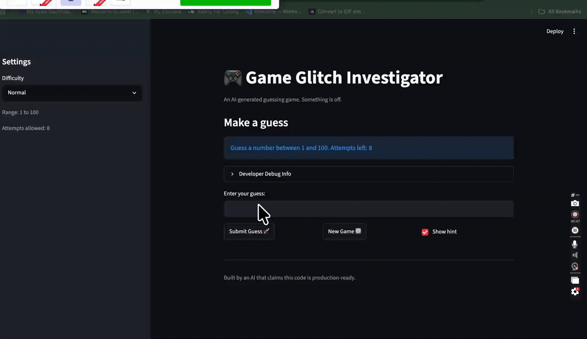

# 🎮 Game Glitch Investigator: The Impossible Guesser

## 🚨 The Situation

Game Glitch Investigator is a Streamlit-based number guessing game where players try to guess a randomly generated secret number. This project originally contained several bugs that made the game difficult to play correctly. The goal of this assignment was to identify the issues, debug the application, refactor the code, and verify the fixes using automated tests.

## 🛠️ Setup

1. Install dependencies: `pip install -r requirements.txt`
2. Run the broken app: `python -m streamlit run app.py`

## Bugs Found
- Bug #1: Incorrect Hint Logic - The game displayed incorrect hints. When the player's guess was too high, the game instructed them to guess higher, and when the guess was too low, it instructed them to guess lower.
- Bug #2: Secret Number Comparison Issue - The secret number was sometimes converted into a string before being compared to the player's guess. This caused inconsistent behavior during gameplay. 
- Bug #3: Game Logic Organization - Most of the game logic was located directly inside app.py, making the application harder to maintain and test.

## ✅ Fixes Applied
- Corrected the hint messages so they accurately guide the player.
- Ensured the secret number remains the correct data type during comparisons.
- Refactored game functions into logic_utils.py.
- Improved code readability and organization.
- Verified functionality using automated tests with pytest.

## 📸 Demo Walkthrough




Describe your fixed game in numbered steps so a reader can follow along without watching a video:

1. Run the app with `python -m streamlit run app.py`.
2. Pick a difficulty.
3. Enter a guess.
4. Click “Submit Guess.”
5. Follow the hint and keep guessing.
6. Win by finding the correct number.
7. Click “New Game” to play again.


**Screenshot** *(optional)*: <!-- Insert a screenshot of your fixed, winning game here -->

## 🧪 Test Results

```
# Paste your pytest output here, e.g.:
# pytest tests/
# ========================= X passed in 0.XXs =========================
```

## 🚀 Stretch Features

- [ ] [If you choose to complete Challenge 4, describe the Enhanced UI changes here — a screenshot is optional]
